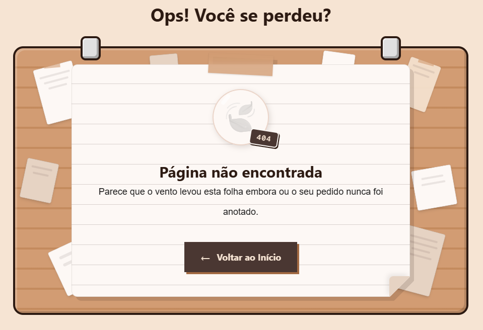

<h1 align=center>
☕<br>
Portfolio - Kauã's Caffè
</h1>
<p align=center>


</p>

> [!NOTE]
> Olá! Seja bem-vindo ao meu portfolio. Ele foi feito utilizando React, TailwindCSS e Vite, pensando em criar um ambiente aconchegante e acolhedor. Nada melhor do que uma cafeteria, não acha? Assim surgiu o tema.



---

## 🚧 Ajustes e Melhorias

O projeto ainda está em desenvolvimento, mas há muito por vir!

- [ ] Adicionar página pessoal
- [ ] Adicionar mais de 3 projetos
- [ ] Adicionar easter-eggs ao redor do ambiente
- [ ] Fazer alguma integração de IA no portfolio
- [ ] Ajustar acessibilidade de pessoas com necessidades

## 🚀 Guia de Paginação

- **Profissional:** Aqui é onde há todas as informações profissionais sobre mim. Seja minha formação, meu belo rosto e minha motivação/paixão pela programação
- **Pessoal:** Ainda em desenvolvimento. Será uma página para conhecer mais sobre quem realmente é Kauã Fernandes, e não apenas euKauatf. Terá meus hobbies e projetos próprios.
- **Contato:** Uma página simples e que acrescenta facilidade para se comunicar comigo, a fim de enviar propostas e conversar sobre determinado projeto.
- **Página Não Encontrada:** Apenas se perca pelo portfolio... 🍃

---

## 📞 Contatos

Atualmente estou aberto para oportunidades de desenvolvimento. Se precisar de alguém para transformar boas ideias em projetos de beleza como o portfolio, considere o meu contato!

- Email: <a>kauafvr1612@gmail.com</a>
- LinkedIn: <a href="https://www.linkedin.com/in/eukauatf/" target="_blank"> Clique aqui para acessar </a>

---

## 📂 Estrutura do Projeto

```text
MEUPORTFOLIO/
├── app/
|   ├── src/
|   |   ├── @types/
|   |   ├── assets/
|   |   ├── components/
|   |   ├── hooks/
|   |   ├── pages/
|   |   ├── routes/
|   |   ├── styles/
|   |   └── main.tsx
|   ├── index.html
│   └── example.txt
└── README.md
```

---
